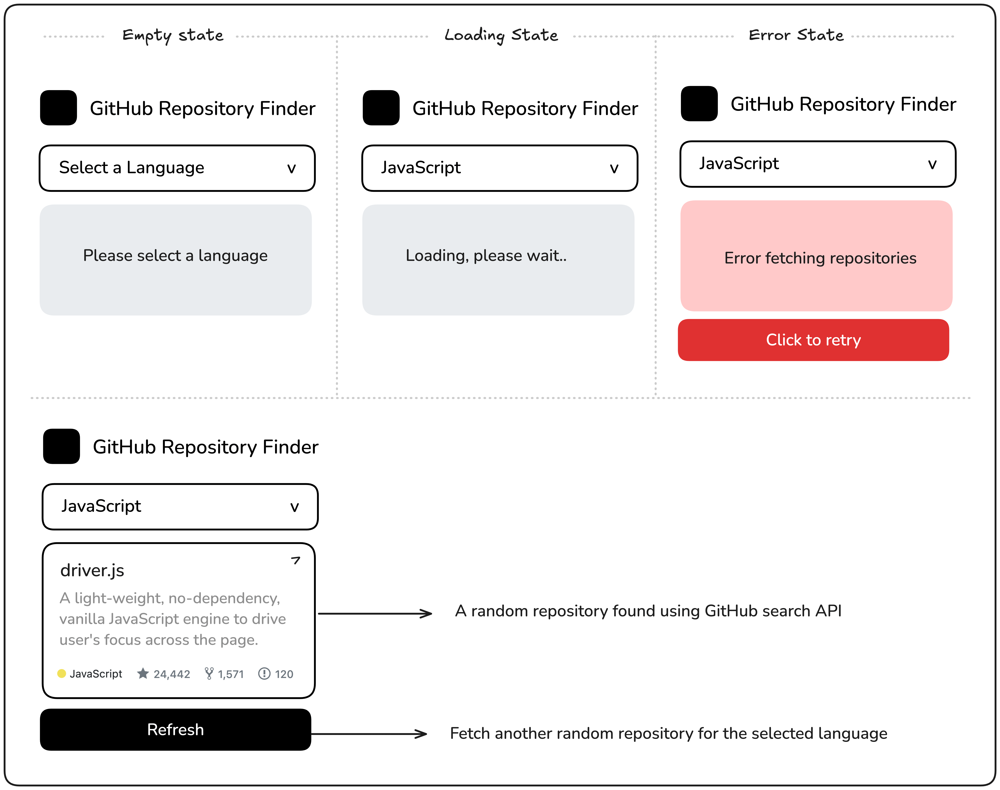

# 🔍 GitHub Random Repo

Um buscador aleatório de repositórios do GitHub que permite explorar projetos por linguagem de programação. Desenvolvido para praticar integração com APIs, gerenciamento de estados assíncronos e lógica de UI.



## 🎯 Objetivo
Este projeto é baseado no desafio [GitHub Random Repo](https://roadmap.sh/projects/github-random-repo) do **Roadmap.sh**. O foco é demonstrar o domínio de requisições assíncronas (Fetch/Async/Await) e o tratamento de diferentes estados de interface (UX).

## 🧠 Pensamento Computacional (Raciocínio)
Diferente de apenas codar, este projeto foi planejado peça por peça:

### 1. Visão Geral
Sistema que filtra a API de busca do GitHub por linguagem e sorteia aleatoriamente um repositório da lista retornada.

### 2. Estrutura de Estados (UX)
A interface foi projetada para lidar com 4 estados distintos:
- **Vazio:** Estado inicial solicitando a interação.
- **Carregamento (Loading):** Feedback visual (spinner) durante a espera pela API.
- **Erro:** Tratamento de falhas de rede com opção de tentativa (Retry).
- **Sucesso:** Renderização dinâmica dos dados do repositório sorteado.

### 3. Decisões Técnicas
- **Consumo de API:** Uso da `Fetch API` com `Async/Await` para um código limpo e moderno.
- **Lógica de Sorteio:** Seleção aleatória via `Math.random()` sobre o array de resultados da API.
- **Modularização:** Organização profissional de pastas (`src/` e `tests/`).
- **Qualidade:** Validação da estrutura do DOM e lógica de estados via **Jest**.

## 🚀 Novidades e Melhorias
Recentemente, o projeto recebeu grandes atualizações de UX e Estética:
- **GitHub Dark Theme:** Interface moderna e confortável inspirada no modo escuro oficial do GitHub.
- **Links Diretos:** O nome do repositório agora é um link clicável que abre o projeto no GitHub em uma nova aba.
- **Robustez no CI:** Integração com GitHub Actions para garantir que cada commit seja validado automaticamente.
- **Tratamento de Rate Limit:** O sistema agora identifica e avisa quando o limite da API do GitHub é atingido.

## 🛠️ Tecnologias
- **HTML5 / CSS3** (Custom Properties & Dark Mode)
- **JavaScript Vanilla** (Async/Await & DOM Manipulation)
- **Jest, JSDOM & Node-Fetch** (Testes de Integração)
- **GitHub Search API**
- **GitHub Actions** (CI/CD)

## 🚀 Como Executar o Projeto

1. **Abra o projeto:**
   Basta abrir o arquivo `index.html` no seu navegador ou utilizar um servidor local:
   ```bash
   python3 -m http.server 8000
   ```

2. **Rodar Testes:**
   ```bash
   npm install
   npm test
   ```

---
Desenvolvido por **Gabriel** como parte do seu aprendizado contínuo em Ciência da Computação. 🚀
